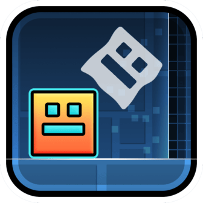

# Platformer Ghosts

Records replays (ghosts) of your platformer runs that you can race and watch!
* Ghosts are automatically saved upon completing a level.

# How to use
* View your saved ghosts for a level by clicking the button in the pause menu.
* To race a ghost, enable the checkered flag button (the best run is chosen by default).
* To watch a ghost, enable the eye button.

Thanks to [Alphalaneous](https://github.com/Alphalaneous) for the mod logo.

